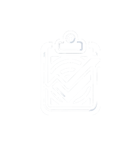

# VerificaAAA

## Introdução

Este repositório tem como propósito fornecer um checklist prático de acessibilidade para projetos, principalmente de desenvolvimento de software, que incluem: desenvolvimento web, design, geração de conteúdo e gestão de projetos. 

## VerificaAAA

O VerificaAAA é nome do projeto criado a partir do curso de Interação Humano Computador, ministrado pela docente Rejane Maria da Costa Figueiredo, na Universidade de Brasília (UnB). 

## Contribuidores

<table>
  <tr>
    <td align="center"><a href="https://github.com/joaoguilherme14"> <b>João Guilherme </b></a> 
    <td align="center"><a href="https://github.com/joaoleless"> <b>joao leles</b></a>    
    <td align="center"><a href="https://github.com/Gotc2607"> <b>Giovani </b></a>    
    <td align="center"><a href="https://github.com/DaviUrsulino "> <b>Davi Ursulino</b></a> 
    <td align="center"><a href="https://github.com/Luizz97 "> <b>Luiz Henrique</b></a> 
    <td align="center"><a href="https://github.com/davirnunes"> <b>Davi Nunes</b></a> 
    <td align="center"><a href="https://github.com/arthurgomes1290"> <b>artur gomes</b></a> 
   
  </tr>
</table>
